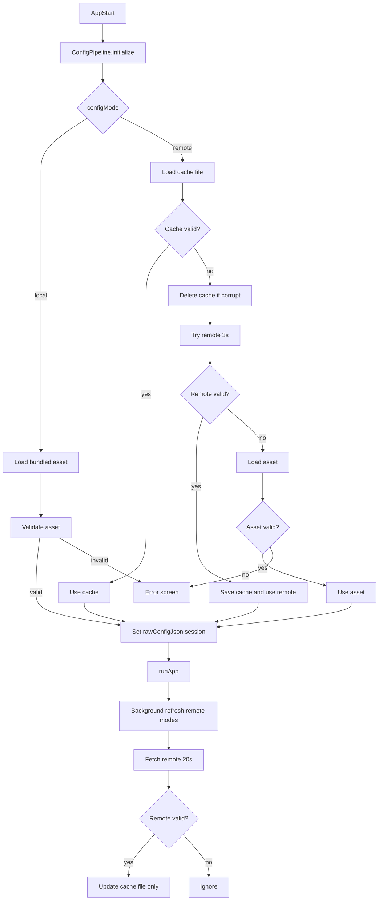

# Remote Config — Full Implementation Plan

## Current baseline (already done)

From [prior session](d1b74a9b-982e-40d5-938a-cf37db80ee34) and current code:

| Done | File |
|------|------|
| Bootstrap + `ConfigMode` enum | [`lib/config/bootstrap_config.dart`](lib/config/bootstrap_config.dart), [`lib/config/config_mode.dart`](lib/config/config_mode.dart) |
| `ConfigPipeline` + `initializeWith()` test hook | [`lib/engine/config_pipeline.dart`](lib/engine/config_pipeline.dart) |
| `MobileAppConfig.fromBootstrapAndRender()` (identity from bootstrap, UI from render JSON) | [`lib/config/mobile_app_config.dart`](lib/config/mobile_app_config.dart) |
| `RemoteConfigFetcher` (raw string, per-call timeout, returns null on failure) | [`lib/config/remote_config_fetcher.dart`](lib/config/remote_config_fetcher.dart) |
| `RemoteConfigSource` (delegates to fetcher; `remoteApi` enabled) | [`lib/config/remote_config_source.dart`](lib/config/remote_config_source.dart) |
| URL resolver (`remoteStorage` + `remoteApi` URL builder) | [`lib/config/remote_config_url.dart`](lib/config/remote_config_url.dart) |
| `SessionConfigResolver` (cache → remote 3s → asset; local validate) | [`lib/config/session_config_resolver.dart`](lib/config/session_config_resolver.dart) |
| `ConfigPipeline` wired to resolver; `sessionSource` populated | [`lib/engine/config_pipeline.dart`](lib/engine/config_pipeline.dart) |
| `main.dart` error screen when all sources fail (incl. local) | [`lib/main.dart`](lib/main.dart) |
| Shared parser | [`lib/features/variantscreen/data/repos/variant_config_parser.dart`](lib/features/variantscreen/data/repos/variant_config_parser.dart) |
| `JsonVariantRepository` + DI for all modes when `rawConfigJson` exists | [`lib/features/variantscreen/data/repos/json_variant_repository.dart`](lib/features/variantscreen/data/repos/json_variant_repository.dart), [`lib/core/utils/service_locator.dart`](lib/core/utils/service_locator.dart) |
| `ConfigValidator` (jsonDecode + shape + `fromBootstrapAndRender`) | [`lib/config/config_validator.dart`](lib/config/config_validator.dart) |
| `ConfigCache` (raw JSON file per `tenantSlug`) | [`lib/config/config_cache.dart`](lib/config/config_cache.dart) |
| `SessionConfigSource` on pipeline result | [`lib/engine/config_pipeline_result.dart`](lib/engine/config_pipeline_result.dart) |
| Error + retry UI | [`lib/core/bootstrap/config_bootstrap_error_app.dart`](lib/core/bootstrap/config_bootstrap_error_app.dart) |
| `launchSooqMerchantApp()` + background sync after `runApp` | [`lib/app/launch_sooq_merchant_app.dart`](lib/app/launch_sooq_merchant_app.dart), [`lib/config/config_background_sync.dart`](lib/config/config_background_sync.dart) |
| `rawConfigJson` on pipeline result | [`lib/engine/config_pipeline_result.dart`](lib/engine/config_pipeline_result.dart) |

**Session 1 completed (2026-06-19):** SSOT foundation — local mode now uses `JsonVariantRepository` via DI; `ConfigValidator` and `ConfigCache` ready for Session 2 resolver wiring. Tests: `json_variant_repository_test.dart`, `config_validator_test.dart`, `config_cache_test.dart`, `service_locator_variant_repository_test.dart`.

**Session 2 completed (2026-06-19):** Startup resolver wired — validate-before-accept cache → remote (3s) → asset; `remoteApi` fetch enabled; `ConfigPipeline` populates `sessionSource`; error screen for all modes on total failure. Tests: `session_config_resolver_test.dart`, `remote_config_fetcher_test.dart`, updated `config_pipeline_test.dart`.

**Session 3 completed (2026-06-19):** Background sync after `runApp` (20s fetch, validate, disk cache only); docs updated (14, 27, 02-config); `split_config_output_test.dart` + `config_background_sync_test.dart`. **Remote config MVP complete.**

**Manual QA** (device verification): local offline tabs; remote cache/timeout/fallback paths; background sync takes effect on relaunch only — see Session 3 checklist in this plan.

**Post-MVP deferred:** CI GitHub Actions workflow, hash/ETag/TTL, mid-session hot reload.

---

## Core principles (locked)

### One session = one config

Once startup resolves the winning source (`cache`, `remote`, or `asset`), that config is the **session source of truth** for the entire app run.

**Must not happen during a session:**
- Hot reload of config
- Router rebuild from new config
- Runtime replacement of `rawConfigJson`
- Background refresh updating in-memory config

**Background refresh:** fetch → validate → update disk cache only → takes effect on **next launch**.

### Single source of truth for rendering

Eliminate multiple JSON readers. Target path for all modes:

```text
ConfigPipeline
        │
        ▼
rawConfigJson          ← resolved once at startup
        │
        ▼
JsonVariantRepository  ← reads Map only; no rootBundle
        │
        ▼
All Screens
```

`JsonVariantRepository` operates on the resolved JSON object regardless of whether it originated from cache, remote, or asset. Local and remote modes share the same runtime path.

---

## Validation contract (explicit)

**Validation** is called before any source is accepted (cache, remote, or asset). A source is never used until validation passes.

```text
Validation =
  jsonDecode(rawString)
  +
  minimal shape check (pages[] or legacy root)
  +
  MobileAppConfig.fromBootstrapAndRender(bootstrap, renderJson)
```

**What validation is:**
- Structural / parse-level check that the config is usable
- Fast enough for startup (no full tree walk of every page component)

**What validation is NOT:**
- Full screen parsing via `VariantConfigParser`
- Render simulation or widget build
- `ComponentSchemas` enforcement per node
- `LayoutConstraintValidator` runs

Invalid cache → delete cache, fall through to next source.
Invalid remote → ignore, fall through to asset.
Invalid asset → total failure (error screen).

> **Note:** The codebase uses `fromBootstrapAndRender` (split bootstrap identity + render JSON), not monolithic `fromJson`. This is the correct validation entry point for remote/cached render JSON. Local mode loads the full asset file but still validates through the same function after extracting render fields.

---

## Startup flow (authoritative)

Source priority: **Cache → Remote → Asset**

Validation gate before accepting any source.

```text
App Start
    │
    ▼
ConfigPipeline.initialize()
    │
    ▼
Load Cache (file)
    │
    ▼
Cache Valid ?
    │
 ┌──┴──┐
 │     │
YES    NO
 │      │
 ▼      ▼
Use     Delete cache (if present)
Cache      │
 │         ▼
 │      Try Remote (3s timeout)
 │         │
 │         ▼
 │      Remote Valid ?
 │         │
 │      ┌──┴──┐
 │      │     │
 │     YES    NO
 │      │     │
 │      ▼     ▼
 │   Save &  Load Asset
 │   Use     │
 │   Remote  ▼
 │      │  Asset Valid ?
 │      │     │
 │      │  ┌──┴──┐
 │      │  │     │
 │      │ YES   NO → Error screen
 │      │  │
 └──────┴──┴──► rawConfigJson + MobileAppConfig
                │
                ▼
             runApp()
                │
                ▼
         Background Refresh (remote modes only)
                │
                ▼
         Fetch Remote (20s timeout)
                │
                ▼
         Remote Valid ?
                │
             ┌──┴──┐
             │     │
            YES    NO
             │      │
             ▼      ▼
         Update   Ignore
         Cache
             │
             ▼
            End
```



---

## Design decisions (locked)

| Decision | Choice | Rationale |
|----------|--------|-----------|
| **Disk cache** | Raw JSON file via `path_provider` | ~202 KB; simplest approach; no Hive, no hash, no ETag |
| **Cache path** | `{appDocumentsDir}/sooq/mobile-config/{tenantSlug}.json` | One file per merchant; scoped by `tenantSlug` |
| **SSOT for pages** | `JsonVariantRepository(rawConfigJson)` for all modes | Eliminates duplicate `rootBundle` reads |
| **Startup remote timeout** | **3 seconds** (range 2–3s) | First-launch budget; get latest config when possible without blocking indefinitely |
| **Background remote timeout** | 20 seconds | Non-blocking; user already has working session config |
| **Change detection** | None for MVP — always replace cache if remote validates | Config is small; add hash/ETag only if proven need |
| **Error app** | Only when cache invalid + remote fail/invalid + asset invalid | Asset fallback handles most offline first-launch cases |
| **Deferred** | Hive, SHA hash, ETag, TTL, mid-session hot reload | Optimize for simplicity first |

---

## Chat session 1 — SSOT + cache foundation ✅ (completed 2026-06-19)

### Step 1.1 — Rename and unify variant repository

- Rename [`json_variant_repository.dart`](lib/features/variantscreen/data/repos/json_variant_repository.dart) (was `cached_variant_repository.dart`), class `JsonVariantRepository`
- Update [`service_locator.dart`](lib/core/utils/service_locator.dart):

```dart
// Always use session JSON when pipeline provides it (local + remote)
if (result?.rawConfigJson != null) {
  return JsonVariantRepository(result!.rawConfigJson!);
}
return AssetVariantRepository(); // safety fallback only (dev route)
```

- Keep [`AssetVariantRepository`](lib/features/variantscreen/data/repos/variant_repository.dart) for legacy `/variant/:id` dev route and tests only
- Update [`json_variant_repository_test.dart`](test/features/variantscreen/json_variant_repository_test.dart) (was `cached_variant_repository_test.dart`)
- **Verify:** local mode pipeline sets `rawConfigJson` — after this step normal tab navigation must **not** re-read `rootBundle`

### Step 1.2 — Config validator

New file: [`lib/config/config_validator.dart`](lib/config/config_validator.dart)

```dart
class ConfigValidator {
  static ConfigValidationResult validateString(
    BootstrapConfig bootstrap,
    String rawJson,
  );

  static ConfigValidationResult validateMap(
    BootstrapConfig bootstrap,
    Map<String, dynamic> json,
  );
}
```

Steps inside `validateString`:
1. `jsonDecode(rawJson)` → `Map<String, dynamic>` (catch → invalid)
2. Minimal shape: `pages[]` or legacy `root` object
3. `MobileAppConfig.fromBootstrapAndRender(bootstrap, renderJson)` (catch → invalid)
4. Return `{ valid: true, renderJson }` — **do not** call `VariantConfigParser`

Used by: session resolver, background sync, and local-mode pipeline.

### Step 1.3 — Disk cache (raw JSON file)

Add `path_provider` to [`pubspec.yaml`](pubspec.yaml).

New file: [`lib/config/config_cache.dart`](lib/config/config_cache.dart)

```dart
class ConfigCache {
  Future<String?> read(BootstrapConfig bootstrap);
  Future<void> write(BootstrapConfig bootstrap, String rawJson);
  Future<void> delete(BootstrapConfig bootstrap);
}
```

- File path: `{appDocumentsDir}/sooq/mobile-config/{tenantSlug}.json`
- `read`: returns raw JSON string or null (missing file)
- `write`: only called **after** validation passes
- `delete`: on invalid/corrupt cache during startup
- No hash sidecar, no metadata file, no ETag storage
- Unit tests in [`test/config/config_cache_test.dart`](test/config/config_cache_test.dart)

### Step 1.4 — Session source metadata

Extend [`ConfigPipelineResult`](lib/engine/config_pipeline_result.dart):

```dart
enum SessionConfigSource { asset, cache, remote }

final SessionConfigSource? sessionSource;
```

DI uses `rawConfigJson != null` (not `usedRemoteConfig`) to register `JsonVariantRepository`.

**Session 1 exit criteria:** `flutter test` green; local mode uses `JsonVariantRepository`; cache file read/write/delete tested.

---

## Chat session 2 — Session resolver + pipeline wiring ✅ (completed 2026-06-19)

### Step 2.1 — Session config resolver

New file: [`lib/config/session_config_resolver.dart`](lib/config/session_config_resolver.dart)

```dart
class SessionConfigResolver {
  Future<SessionConfigResult> resolve(BootstrapConfig bootstrap, {
    Duration startupRemoteTimeout = const Duration(seconds: 3),
  });
}
```

**Remote mode logic (validate before accept):**

```
1. rawCache = ConfigCache.read(bootstrap)
   if rawCache != null:
     if ConfigValidator.validateString(bootstrap, rawCache).valid:
       return source: cache
     else:
       ConfigCache.delete(bootstrap)

2. rawRemote = RemoteConfigFetcher.fetch(bootstrap, timeout: 3s)
   if rawRemote != null:
     if ConfigValidator.validateString(bootstrap, rawRemote).valid:
       ConfigCache.write(bootstrap, rawRemote)
       return source: remote
     // invalid remote → fall through (do not cache)

3. rawAsset = LocalAssetConfigSource.loadFullConfig(bootstrap) as string/map
   if ConfigValidator.validate(...).valid:
     return source: asset
   else:
     return failure
```

**Local mode** (simpler, same validation gate):

```
1. rawAsset = LocalAssetConfigSource.loadFullConfig(bootstrap)
2. validate → if valid: source: asset; else: failure
3. No cache read/write, no remote fetch, no background sync
```

### Step 2.2 — Refactor remote fetch for timeouts

Refactor [`remote_config_source.dart`](lib/config/remote_config_source.dart):
- Extract `RemoteConfigFetcher` with injectable `Dio` + per-call `Duration timeout`
- Startup resolver: **3s** timeout
- Background sync: **20s** timeout
- Enable `remoteApi` fetch path (remove Sprint 4 throw) — URL in [`remote_config_url.dart`](lib/config/remote_config_url.dart)
- Move shape validation out of fetcher into `ConfigValidator` (fetcher returns raw string only)

### Step 2.3 — Wire `ConfigPipeline`

Update [`config_pipeline.dart`](lib/engine/config_pipeline.dart):

| `configMode` | Behavior |
|--------------|----------|
| `local` | Load asset → validate → `rawConfigJson` |
| `remoteStorage` / `remoteApi` | `SessionConfigResolver.resolve()` |

Populate `ConfigPipelineResult` with `sessionSource`, `rawConfigJson`, `loadError` on total failure.

### Step 2.4 — Update `main.dart` error handling

[`main.dart`](lib/main.dart): error screen only when validation fails on **all** sources including asset.

### Step 2.5 — Integration tests

New [`test/config/session_config_resolver_test.dart`](test/config/session_config_resolver_test.dart):

| Case | Expected |
|------|----------|
| Valid cache | `source: cache`, no network |
| Invalid cache → valid remote | `source: remote`, cache rewritten |
| Invalid cache → remote timeout → valid asset | `source: asset` |
| No cache → valid remote | `source: remote`, cache written |
| No cache → remote timeout → valid asset | `source: asset` |
| Invalid cache → invalid remote → invalid asset | failure |
| Validator rejects malformed JSON on any source | source not accepted |

**Session 2 exit criteria:** full resolver flow tested; `remoteStorage` and `remoteApi` work; local mode unchanged.

---

## Chat session 3 — Background sync + polish + docs ✅ (completed 2026-06-19)

### Step 3.1 — Background refresh

New file: [`lib/config/config_background_sync.dart`](lib/config/config_background_sync.dart)

Called from [`launch_sooq_merchant_app.dart`](lib/app/launch_sooq_merchant_app.dart) **after** `runApp()`:

```dart
runApp(...);
ConfigBackgroundSync.scheduleIfNeeded(pipelineResult);
```

**Rules:**
- Skip when `configMode == local`
- `unawaited` Future — never blocks UI
- Fetch remote (20s) → `ConfigValidator.validateString` → if valid: `ConfigCache.write` → done
- On failure or invalid: ignore (debug log)
- **Never** touch `rawConfigJson`, router, or DI

### Step 3.2 — Asset split tool verification

Ensure [`tool/split_config.dart`](tool/split_config.dart) outputs render-only JSON that passes `ConfigValidator`.

### Step 3.3 — Simplicity guardrails

- No Hive, hash, ETag, TTL in this implementation
- `AssetVariantRepository` documented as dev-route-only
- `ConfigPipeline.initializeWith(sourceOverride:)` preserved for tests

### Step 3.4 — Documentation updates

| File | Update |
|------|--------|
| [`docs/ai/14-mobile-build-config-pipeline-plan.md`](docs/ai/14-mobile-build-config-pipeline-plan.md) | Session resolver, validation contract, file cache |
| [`docs/engine/builder-specs/27-bootstrap-config.md`](docs/engine/builder-specs/27-bootstrap-config.md) | File cache path; background sync behavior |
| [`docs/ai/02-config-and-json.md`](docs/ai/02-config-and-json.md) | SSOT: `rawConfigJson` → `JsonVariantRepository` |

### Step 3.5 — Manual QA checklist

1. **Local mode:** starts offline, all tabs render via `JsonVariantRepository`
2. **Remote, no cache, network OK:** ≤3s wait → remote UI → cache file written
3. **Remote, no cache, airplane mode:** asset UI after 3s timeout
4. **Remote, valid cache, offline:** cached UI immediately
5. **Remote, corrupt cache file:** deleted → remote or asset
6. **Second launch offline:** valid cache used
7. **Background sync:** change remote JSON → relaunch → new UI (not mid-session)

**Session 3 exit criteria:** `flutter test` green; QA checklist passed; docs updated.

---

## File change summary

| Action | Path |
|--------|------|
| **New** | `lib/config/config_validator.dart` |
| **New** | `lib/config/config_cache.dart` |
| **New** | `lib/config/session_config_resolver.dart` |
| **New** | `lib/config/config_background_sync.dart` |
| **New** | `lib/config/remote_config_fetcher.dart` |
| **Rename** | `cached_variant_repository.dart` → `json_variant_repository.dart` (done Session 1) |
| **Edit** | `pubspec.yaml` (add `path_provider`) |
| **Edit** | `lib/engine/config_pipeline.dart` |
| **Edit** | `lib/engine/config_pipeline_result.dart` |
| **Edit** | `lib/config/remote_config_source.dart` |
| **Edit** | `lib/core/utils/service_locator.dart` |
| **Edit** | `lib/main.dart` |
| **Edit** | `lib/app/launch_sooq_merchant_app.dart` |
| **New tests** | `test/config/config_validator_test.dart`, `config_cache_test.dart`, `session_config_resolver_test.dart` |

---

## What we explicitly defer (post-MVP)

- GitHub Actions CI workflow (Sprint 3 in doc 14)
- Hash / ETag / TTL optimization
- Hive
- Mid-session config hot reload
- `shared_preferences` for config (file is sufficient at ~202 KB)

---

## Risk notes

| Risk | Mitigation |
|------|------------|
| First launch waits up to 3s on slow network | By design; asset after timeout |
| Corrupt cache file | Validate before use; delete and fall through |
| `AssetVariantRepository` for `/variant/:id` | Dev route only; document |
| Background cache update invisible until relaunch | By design; log `sessionSource` |

---

## One-line reminder

**Validate before accept. One session = one config. `rawConfigJson` → `JsonVariantRepository` for everything.**
