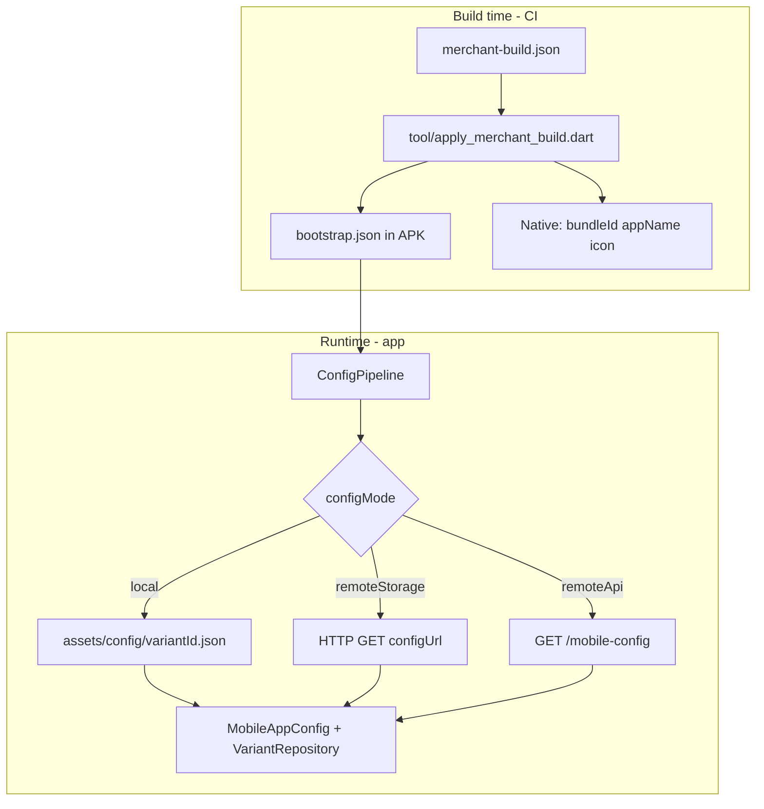

# 14 — Mobile Build & Config Pipeline Plan

**Status:** Sprint 1 implemented (local mode + build script) — Sprints 2–4 pending  
**Purpose:** Handoff spec for implementing dual config loading (local + remote) and GitHub Actions APK builds before the builder/backend integration is ready.

**Read with:** [AGENTS.md](../../AGENTS.md) · [RULES.md](../../RULES.md) · [02-config-and-json.md](02-config-and-json.md) · [08-feature-variant-shell.md](08-feature-variant-shell.md) · [12-production-status.md](12-production-status.md)

---

## 1. Goals & constraints

### Goals

1. **Keep the current local dev path** — `assets/config/mobile_production_v2.json` and `AssetVariantRepository` must continue to work unchanged for daily development and existing tests.
2. **Add a future-ready remote path** — full UI config fetched at runtime; use **object storage URL now**, swap to **backend API** later with minimal code change.
3. **Test end-to-end CI** — GitHub Actions → merchant build manifest → patched native identity → APK artifact, before builder/backend are integrated.
4. **Remove hardcoded merchant identity** — `appName`, `bundleId`, icon, and tenant wiring must come from injected bootstrap, not scattered native/Dart defaults.

### Constraints (from project rules)

- JSON-first UI — no per-merchant Dart UI branches (`tenantSlug` conditionals forbidden).
- Layer boundaries — config fetch orchestration in `lib/config/` / `lib/engine/`; HTTP for domain APIs stays in features; variant parsing stays in `variant_repository.dart`.
- Do **not** delete `mobile_production_v2.json` or break existing `flutter test` suite.
- Bootstrap JSON for production builds is **not committed** to the template repo — CI generates it per merchant.
- Transient user messages remain `AppMessenger` (unchanged by this work).

### Non-goals (this plan)

- iOS CI / App Store upload (can follow same pattern later).
- Play Store release signing (debug signing OK for first milestone).
- Backend/builder implementation (document contract only).
- Splitting the 6200-line prod JSON manually (use a script when needed).

---

## 2. Problem statement (current state)

Today everything lives in one bundled file and is loaded from assets only:

| Concern | Current implementation | Gap |
|---------|------------------------|-----|
| Full UI JSON | `assets/config/mobile_production_v2.json` | Must also load from storage/API |
| Config loader | `AppConfigLoader` → `rootBundle` only | No remote source |
| Page loader | `AssetVariantRepository` → `rootBundle` only | No in-memory/cached remote JSON |
| Active config id | `const _kActiveConfig = 'mobile_production_v2'` in `main.dart` | Hardcoded |
| Android package | `com.example.sooq_merchant` in `build.gradle.kts` | Mismatches JSON `com.sooq.merchant.mobile` |
| Android label | `SOOQ` in `AndroidManifest.xml` | Mismatches JSON app name |
| iOS display name | `SOOQ` in `Info.plist` | Mismatches JSON app name |
| iOS bundle id | `com.example.sooqMerchant` in `project.pbxproj` | Mismatches JSON |
| Launcher icon | Static `assets/icons/app_logo_masked.png` in `pubspec.yaml` | Not per-merchant |
| CI/CD | No `.github/workflows/` | None |

**Key files today:**

- `lib/main.dart` — `_kActiveConfig`, startup
- `lib/engine/app_config_loader.dart` — asset-only top-level config
- `lib/features/variantscreen/data/repos/variant_repository.dart` — `AssetVariantRepository`
- `lib/core/utils/service_locator.dart` — registers `AssetVariantRepository`
- `lib/config/mobile_app_config.dart` — parses `app`, `theme`, `navigation`, `pages`

---

## 3. Target architecture

### Two config layers

```
┌─────────────────────────────────────────────────────────────┐
│  BUILD TIME (CI injects per merchant)                       │
│  bootstrap.json → appName, bundleId, tenant, apiBaseUrl,    │
│                   configMode, configUrl                     │
│  + native patches (Android/iOS package, label, icon)        │
└─────────────────────────────────────────────────────────────┘
                              │
                              ▼
┌─────────────────────────────────────────────────────────────┐
│  RUNTIME (app startup)                                      │
│  full config JSON → schemaVersion, theme, navigation, pages │
│  Source depends on configMode (see §4)                      │
└─────────────────────────────────────────────────────────────┘
```

### Startup flow (target)

```
main()
  → ConfigPipeline.initialize()
      1. Load bootstrap (bundled asset; CI-generated in prod)
      2. NetworkConfig.fromAppConfig(bootstrap api/tenant)
      3. setupServiceLocator (partial — network first)
      4. Load full config JSON (local asset | storage URL | API)
      5. MobileAppConfig.fromJson(merged)
      6. Register VariantRepository (asset | in-memory from fetched JSON)
      7. AppRouter.setupRouter(mobileConfig)
  → runApp(...)
```

### Mermaid overview



---

## 4. Three config modes

Add `configMode` to bootstrap. All three coexist; switch via bootstrap only.

| Mode | Bootstrap source | Full config source | When to use |
|------|------------------|-------------------|-------------|
| `local` | `assets/config/bootstrap.json` (dev: copy from `bootstrap.local.json`) | `assets/config/{variantId}.json` — **existing monolithic file OK** | Daily dev, engine work, CI smoke test (milestone 1) |
| `remoteStorage` | CI-injected bootstrap | HTTP GET `bootstrap.configUrl` (Firebase/S3/R2/GitHub raw) | Test full remote flow before backend exists (milestone 2) |
| `remoteApi` | CI-injected bootstrap | `GET {apiBaseUrl}/api/v1/public/mobile-config?tenantSlug=...` | When backend is ready (milestone 4) — same Dart path as storage, different URL resolver |

`remoteStorage` and `remoteApi` share one `RemoteConfigSource` class; only URL construction differs.

---

## 5. File & JSON contracts

### 5.1 Bootstrap (`assets/config/bootstrap.json`)

**Committed for dev:** `assets/config/bootstrap.local.json` (template)  
**Gitignored:** `assets/config/bootstrap.json` (real file; CI writes per build)

```json
{
  "schemaVersion": "1.0",
  "configMode": "local",
  "variantId": "mobile_production_v2",
  "appName": "SOOQ Merchant Mobile",
  "bundleId": "com.sooq.merchant.mobile",
  "apiBaseUrl": "https://sooq.up.railway.app",
  "tenantId": "3fc183e8-ac80-4b2a-8bf1-4cd6ac6ffcb1",
  "tenantSlug": "anasgoldenmer",
  "configUrl": null,
  "iconUrl": null
}
```

| Field | Build-time | Runtime | Notes |
|-------|------------|---------|-------|
| `appName` | ✓ patched to native | ✓ | Launcher / store display name |
| `bundleId` | ✓ patched to native | ✓ | Must match Android `applicationId` + iOS `PRODUCT_BUNDLE_IDENTIFIER` |
| `apiBaseUrl` | ✓ | ✓ | `NetworkConfig.baseUrl` |
| `tenantId` / `tenantSlug` | ✓ | ✓ | Public API tenant headers |
| `configMode` | ✓ | ✓ | `local` \| `remoteStorage` \| `remoteApi` |
| `variantId` | ✓ | ✓ | Asset filename stem for `local` mode only |
| `configUrl` | ✓ | ✓ | Required when `configMode == remoteStorage` |
| `iconUrl` | ✓ (CI downloads) | — | Optional; CI fetches before `flutter_launcher_icons` |

### 5.2 Full runtime config (`mobile-config.json`)

When using remote modes, uploaded JSON contains **UI + shell** (same shape as today minus redundant build identity):

```json
{
  "schemaVersion": "1.0",
  "app": {
    "name": "...",
    "bundleId": "...",
    "apiBaseUrl": "...",
    "tenantId": "...",
    "tenantSlug": "..."
  },
  "theme": { },
  "navigation": { },
  "pages": [ ]
}
```

**Local mode (Phase 1):** keep using monolithic `mobile_production_v2.json` — no physical split required.

**Remote mode (Phase 2+):** `tool/split_config.dart` extracts from prod JSON → uploads `mobile-config.json` to storage. Bootstrap `app` block can override or merge with fetched `app` block (bootstrap wins for `apiBaseUrl`/tenant if conflict).

### 5.3 Merchant build manifest (CI input)

Hand-written for testing; later generated by builder. **Not committed** — passed as workflow input or fetched from storage.

```json
{
  "appName": "Anas Golden Store",
  "bundleId": "com.anasgoldenmer.shop",
  "apiBaseUrl": "https://sooq.up.railway.app",
  "tenantId": "3fc183e8-ac80-4b2a-8bf1-4cd6ac6ffcb1",
  "tenantSlug": "anasgoldenmer",
  "configMode": "remoteStorage",
  "configUrl": "https://storage.example.com/merchants/anasgoldenmer/mobile-config.json",
  "iconUrl": "https://storage.example.com/merchants/anasgoldenmer/icon.png",
  "version": "1.0.0",
  "buildNumber": 1
}
```

---

## 6. Hardcoded values to fix

| Current | Location | Fix |
|---------|----------|-----|
| `_kActiveConfig = 'mobile_production_v2'` | `lib/main.dart` | `bootstrap.variantId` |
| `applicationId` / `namespace` | `android/app/build.gradle.kts` | `tool/apply_merchant_build.dart` |
| `android:label` | `AndroidManifest.xml` | same script |
| `CFBundleDisplayName` / `CFBundleName` | `ios/Runner/Info.plist` | same script |
| `PRODUCT_BUNDLE_IDENTIFIER` | `ios/Runner.xcodeproj/project.pbxproj` | same script |
| `flutter_launcher_icons.image_path` | `pubspec.yaml` | CI downloads icon → patch path or use fixed `assets/icons/merchant_icon.png` |
| `kAppName = 'SOOQ'` | `lib/core/utils/constants.dart` | Remove unused const or derive from `MobileAppConfig.appName` |
| `AssetVariantRepository` only | `service_locator.dart` | Factory: local → asset repo; remote → in-memory/cached repo |
| Default `apiBaseUrl` fallback | `network_config.dart` | Keep as safety net; bootstrap must always be set in CI builds |

**Stays unchanged:** engine renderers, tab shell, request mapper, feature repos, JSON page schema.

---

## 7. Implementation plan (sprints)

### Sprint 1 — Foundation + local mode (Milestone 1)

**Objective:** Config pipeline with `local` mode only; build script patches native identity; dev workflow unchanged.

#### 7.1.1 New Dart files

| File | Responsibility |
|------|----------------|
| `lib/config/bootstrap_config.dart` | Model + `fromJson` for bootstrap |
| `lib/config/config_mode.dart` | Enum: `local`, `remoteStorage`, `remoteApi` |
| `lib/config/config_source.dart` | Abstract `AppConfigSource` interface |
| `lib/config/local_asset_config_source.dart` | Bootstrap from asset; full JSON from `assets/config/{variantId}.json` |
| `lib/engine/config_pipeline.dart` | Orchestrates bootstrap → full config → `MobileAppConfig` |
| `lib/engine/config_pipeline_result.dart` | Holds `MobileAppConfig` + raw JSON for variant repo |

#### 7.1.2 Modify existing files

| File | Change |
|------|--------|
| `lib/main.dart` | Replace `AppConfigLoader.load(_kActiveConfig)` with `ConfigPipeline` |
| `lib/core/utils/service_locator.dart` | Accept optional preloaded config JSON; register variant repo by mode |
| `pubspec.yaml` | Ensure `assets/config/` includes bootstrap (add `bootstrap.local.json`) |

#### 7.1.3 Dev bootstrap template

- Add `assets/config/bootstrap.local.json` (committed).
- Document: copy to `bootstrap.json` for local runs, or pipeline falls back to `bootstrap.local.json` in debug.
- Add to `.gitignore`: `assets/config/bootstrap.json`, `assets/config/mobile-config.json`, `assets/icons/merchant_icon.png`.

#### 7.1.4 Build tools

| Script | Purpose |
|--------|---------|
| `tool/apply_merchant_build.dart` | Read `merchant-build.json`; patch Android/iOS native files; write `assets/config/bootstrap.json` |
| `tool/merchant_build_manifest.schema.json` | Optional JSON schema for manifest validation |

**`apply_merchant_build.dart` must patch:**

1. `android/app/build.gradle.kts` — `applicationId`, `namespace`
2. `android/app/src/main/AndroidManifest.xml` — `android:label`
3. `ios/Runner/Info.plist` — `CFBundleDisplayName`, `CFBundleName`
4. `ios/Runner.xcodeproj/project.pbxproj` — `PRODUCT_BUNDLE_IDENTIFIER` (all configs)
5. `assets/config/bootstrap.json` — full bootstrap from manifest

#### 7.1.5 Tests

| Test | File |
|------|------|
| `BootstrapConfig` parsing | `test/config/bootstrap_config_test.dart` |
| `ConfigPipeline` local mode loads prod JSON | `test/engine/config_pipeline_test.dart` |
| Existing suite | `flutter test` — must pass with zero regressions |

#### 7.1.6 Manual verification

```bash
# 1. Copy dev bootstrap
cp assets/config/bootstrap.local.json assets/config/bootstrap.json

# 2. Run app — should behave exactly as before
flutter run

# 3. Test build script locally
dart run tool/apply_merchant_build.dart tool/fixtures/merchant-build.example.json
flutter build apk --release
# Verify: launcher name + package id match manifest
```

**Milestone 1 done when:** App runs in `local` mode identically to today; `apply_merchant_build.dart` changes native label/package; `flutter test` green.

---

### Sprint 2 — Remote storage path (Milestone 2)

**Objective:** App fetches full config from a public URL; caches for offline.

#### 7.2.1 New Dart files

| File | Responsibility |
|------|----------------|
| `lib/config/remote_config_source.dart` | HTTP fetch + cache; URL from `configUrl` or API path |
| `lib/config/config_cache.dart` | Persist fetched JSON (`shared_preferences` or file) |
| `lib/features/variantscreen/data/repos/cached_variant_repository.dart` | Holds parsed JSON map; delegates to existing `_parseBuilderScreenConfig` logic |

#### 7.2.2 Refactor (minimal)

Extract parsing helpers from `AssetVariantRepository` into package-private top-level functions or `VariantConfigParser` class in same file — **do not change parse behavior**. Both asset and cached repos call shared parser.

#### 7.2.3 Build tools

| Script | Purpose |
|--------|---------|
| `tool/split_config.dart` | `mobile_production_v2.json` → `mobile-config.json` (+ optional bootstrap extract) |
| `tool/upload_config_to_storage.dart` | Dev helper: upload to Firebase/S3 (optional; manual upload OK for v1) |

#### 7.2.4 Storage setup (manual for first test)

1. Run `dart run tool/split_config.dart`
2. Upload `mobile-config.json` to public URL (Firebase Storage, R2, or GitHub raw in a configs repo)
3. Set `configMode: remoteStorage` + `configUrl` in merchant manifest

#### 7.2.5 Startup UX

- Show splash/loading while fetching (reuse existing splash page route if possible — JSON-driven, no new Dart screen unless needed).
- On fetch failure: use cache if available; else show error state with retry (minimal — can be a simple `MaterialApp` error scaffold in pipeline only for v1).

**Milestone 2 done when:** APK with `remoteStorage` bootstrap downloads JSON from URL on first launch and renders app correctly; second launch works offline from cache.

---

### Sprint 3 — GitHub Actions (Milestone 3)

**Objective:** `workflow_dispatch` builds APK with injected merchant identity.

#### 7.3.1 New files

```
.github/workflows/build-merchant-android.yml
tool/fixtures/merchant-build.example.json
```

#### 7.3.2 Workflow inputs

| Input | Required | Description |
|-------|----------|-------------|
| `tenant_slug` | yes | Merchant identifier (artifact naming) |
| `config_mode` | yes | `local` or `remoteStorage` |
| `config_url` | if remote | Public URL to `mobile-config.json` |
| `app_name` | yes | Display name |
| `bundle_id` | yes | Package name |
| `build_number` | no | Default `1` |

Workflow steps:

1. `actions/checkout@v4`
2. `subosito/flutter-action@v2` (stable, cache)
3. Build `merchant-build.json` from inputs (or download from future builder API)
4. `dart run tool/apply_merchant_build.dart merchant-build.json`
5. `dart run tool/download_merchant_assets.dart` (if `iconUrl` set; else skip)
6. `dart run flutter_launcher_icons` (if icon downloaded)
7. `flutter pub get`
8. `flutter test`
9. `flutter build apk --release --build-name=... --build-number=...`
10. `actions/upload-artifact@v4` — `{tenant_slug}-android-apk`

#### 7.3.3 Two CI test paths

| Job | configMode | Validates |
|-----|------------|-----------|
| **A: local bundle** | `local` | CI injection + embedded JSON + APK installs |
| **B: storage fetch** | `remoteStorage` | CI injection + runtime fetch (requires uploaded config) |

Run **A first** — no external dependencies.

**Milestone 3 done when:** GitHub Actions produces downloadable APK; installed app shows correct `appName` on launcher; app loads config per mode.

---

### Sprint 4 — Backend-ready hook (Milestone 4)

**Objective:** Swap storage URL for API endpoint when backend ships.

#### 7.4.1 API contract (give to backend team)

```
GET /api/v1/public/mobile-config?tenantSlug={slug}
Headers: Accept: application/json
Auth: none (public, same pattern as catalog)
Response 200: full mobile JSON (schemaVersion, app, theme, navigation, pages)
Response 404: tenant has no published mobile config
```

#### 7.4.2 App change

- `RemoteConfigSource` adds `remoteApi` URL builder: `{apiBaseUrl}/api/v1/public/mobile-config?tenantSlug={tenantSlug}`
- Bootstrap `configMode: remoteApi` — ignore `configUrl`
- Builder webhook (future): `POST /repos/{owner}/{repo}/dispatches` with `event_type: build-merchant-app`

**Milestone 4 done when:** Same APK code fetches from API by changing bootstrap only.

---

## 8. Variant repository strategy

Do **not** remove `AssetVariantRepository`.

| Mode | Repository | Data source |
|------|------------|-------------|
| `local` | `AssetVariantRepository` (existing) | `rootBundle.loadString` |
| `remoteStorage` / `remoteApi` | `CachedVariantRepository` (new) | In-memory `Map` from fetched JSON; same parser as asset repo |

Registration in `service_locator.dart`:

```dart
getIt.registerLazySingleton<VariantRepository>(() {
  if (pipelineResult.usedRemoteConfig) {
    return CachedVariantRepository(pipelineResult.rawConfigJson);
  }
  return AssetVariantRepository();
});
```

---

## 9. JSON split strategy (phased)

### Phase 1 — No physical split (recommended first)

`local` mode loads full `mobile_production_v2.json` by `variantId`. Zero change to the 6200-line file.

### Phase 2 — Script-based split (when testing storage)

`tool/split_config.dart`:

```
Input:  assets/config/mobile_production_v2.json
Output: assets/config/mobile-config.json  (theme + navigation + pages + app block)
        merchant-build.json fields        (app.name → appName, app.bundleId → bundleId, etc.)
```

Upload output to storage; bootstrap points to URL.

---

## 10. `.gitignore` additions

```
assets/config/bootstrap.json
assets/config/mobile-config.json
assets/icons/merchant_icon.png
merchant-build.json
```

---

## 11. Backend / builder integration (future)

When builder + backend are ready:

1. Builder saves mobile JSON → storage + DB.
2. Builder exposes `GET /merchants/{slug}/build-manifest` for CI.
3. Builder triggers GitHub `repository_dispatch` on "Build app" click.
4. CI fetches manifest → `apply_merchant_build` → APK.
5. App uses `configMode: remoteApi` (or `remoteStorage` with CDN URL).

**Mobile repo changes at that point:** workflow input source only — no engine changes.

---

## 12. Success criteria checklist

### Milestone 1 (local + build script)
- [x] `flutter run` with `bootstrap.local.json` works identically to today
- [x] All existing tests pass
- [x] `apply_merchant_build.dart` patches Android label + package id
- [x] `MobileAppConfig` still parses from `mobile_production_v2.json` in local mode

### Milestone 2 (remote storage)
- [ ] App fetches config from public URL on cold start
- [ ] Config cached; app works offline on second launch
- [ ] `CachedVariantRepository` renders all tab routes correctly

### Milestone 3 (GitHub Actions)
- [ ] `workflow_dispatch` produces APK artifact
- [ ] APK launcher shows injected `appName`
- [ ] `local` mode CI job: APK runs without network for config
- [ ] `remoteStorage` CI job: APK fetches config from URL

### Milestone 4 (API ready)
- [ ] `remoteApi` mode works against real endpoint
- [ ] Switching storage → API requires bootstrap change only

---

## 13. Files to create (summary)

### Dart (lib/)
- `lib/config/bootstrap_config.dart`
- `lib/config/config_mode.dart`
- `lib/config/config_source.dart`
- `lib/config/local_asset_config_source.dart`
- `lib/config/remote_config_source.dart` (Sprint 2)
- `lib/config/config_cache.dart` (Sprint 2)
- `lib/engine/config_pipeline.dart`
- `lib/features/variantscreen/data/repos/cached_variant_repository.dart` (Sprint 2)

### Tools (tool/)
- `tool/apply_merchant_build.dart`
- `tool/split_config.dart` (Sprint 2)
- `tool/download_merchant_assets.dart` (Sprint 3)
- `tool/fixtures/merchant-build.example.json`

### Config (assets/)
- `assets/config/bootstrap.local.json`

### CI (.github/)
- `.github/workflows/build-merchant-android.yml` (Sprint 3)

### Tests (test/)
- `test/config/bootstrap_config_test.dart`
- `test/engine/config_pipeline_test.dart`

---

## 14. Files to modify (summary)

- `lib/main.dart`
- `lib/core/utils/service_locator.dart`
- `lib/features/variantscreen/data/repos/variant_repository.dart` (extract shared parser only)
- `.gitignore`
- `pubspec.yaml` (if asset paths change)

**Do not modify for Sprint 1:** engine renderers, `mobile_production_v2.json`, feature repos.

---

## 15. Instructions for the implementing agent

When starting a new chat in **plan mode**, provide:

1. This file: `docs/ai/14-mobile-build-config-pipeline-plan.md`
2. `AGENTS.md`, `RULES.md`
3. Scope to **one sprint at a time** — default: **Sprint 1 only**
4. Run `flutter test` before marking sprint complete
5. Do not commit `bootstrap.json` or `merchant-build.json`
6. Do not remove `AssetVariantRepository` or `mobile_production_v2.json`
7. Do not add per-merchant `if (tenantSlug == ...)` branches
8. After Sprint 1, update this doc's checklist (§12) with completion status

### Suggested first prompt for implementer

> Implement Sprint 1 from `docs/ai/14-mobile-build-config-pipeline-plan.md`: bootstrap model, ConfigPipeline with local mode only, wire main.dart, add bootstrap.local.json, add tool/apply_merchant_build.dart, tests. Keep mobile_production_v2.json and AssetVariantRepository unchanged. Run flutter test when done.

---

## 16. Open decisions (resolve during implementation)

| Decision | Options | Recommendation |
|----------|---------|----------------|
| Bootstrap fallback in debug | Copy `bootstrap.local.json` vs auto-load `bootstrap.local.json` if `bootstrap.json` missing | Auto-load `.local` in debug — less dev friction |
| Config cache storage | `shared_preferences` vs `path_provider` file | File via `path_provider` — large JSON |
| Splash during remote fetch | Block on splash route vs overlay on first frame | Reuse JSON splash page; extend pipeline to delay router until config ready |
| Icon download in CI | Required vs optional first milestone | Optional — skip `flutter_launcher_icons` if no `iconUrl` |
| iOS in CI | Same sprint vs later | Later — Android first |

---

*Last updated: 2026-06-13 — planning handoff document.*
