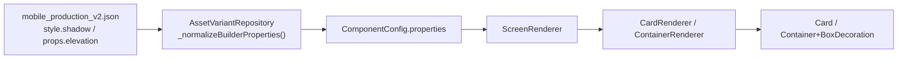

# Shadow System Diagnostic Report

**Date:** 2026-06-12  
**Status:** Closed — production tokens + Pass A JSON applied. See [`shadow_audit_summary.md`](shadow_audit_summary.md).  
**Scope:** Root-cause analysis of Pass A visual changes appearing invisible  
**Prod config:** `mobile_production_v2.json` · **Engine:** M3 (`useMaterial3: true`)

---

## Executive verdict

**The rendering pipeline works.** Pass A values reach parsed models and renderers correctly. The reason Pass A looks almost unchanged is **not** a broken JSON→widget path or systematic clipping.

The dominant causes are:

| Rank | Cause | Impact |
|------|--------|--------|
| 1 | **Shadow tokens are too weak** for `#F1F5F9` page backgrounds | `sm`/`md` nearly invisible; `lg`/`xl` only clearly visible |
| 2 | **Material 3 low elevation is extremely flat** | `elevation: 1–2` on `Card` produces tonal/border-like depth, not a readable drop shadow |
| 3 | **Prod JSON still flat by design** | 30/32 cards at `elevation: 0`; only 3 container `shadow` keys in entire config |
| 4 | **Structural/UX masking** | Autocomplete panel collapses to zero height until search request fires |

**Not a primary cause:** parent clipping, theme flattening overrides, or values failing to parse.

Evidence: [`test/engine/shadow_diagnostic_test.dart`](../test/engine/shadow_diagnostic_test.dart) + goldens in [`test/engine/goldens/`](../test/engine/goldens/).

---

## 1. Pipeline trace: JSON → widget

### Path



### Style merge (builder JSON)

[`variant_repository.dart`](../lib/features/variantscreen/data/repos/variant_repository.dart) maps:

- `style.shadow` → `properties['shadow']` (L339–340)
- `style.background` → `properties['color']`
- `props.elevation` → `properties['elevation']` (cards only; no `style.elevation` merge)

### Renderer application

| Type | Prop | Renderer | Flutter API |
|------|------|----------|-------------|
| `container` | `shadow: sm\|md\|lg\|xl` | [`container_renderer.dart`](../lib/engine/tree/renderers/container_renderer.dart) | `BoxDecoration.boxShadow` via [`ShadowParser`](../lib/engine/theme/shadow_parser.dart) |
| `card` | `elevation: number` | [`card_renderer.dart`](../lib/engine/tree/renderers/card_renderer.dart) | `Card(elevation: …)` |
| `textFormField` | `shadow` | [`text_form_field_renderer.dart`](../lib/engine/tree/renderers/text_form_field_renderer.dart) | `DecoratedBox` + `boxShadow` |
| `appBar` | `elevation` | [`app_bar_renderer.dart`](../lib/engine/tree/renderers/app_bar_renderer.dart) | `Material(elevation: …)` |

### Runtime verification (automated)

`shadow_diagnostic_test.dart` loads prod JSON and asserts:

| Node ID | Expected | Parsed |
|---------|----------|--------|
| `home-search-autocomplete-panel` | `shadow: md` | ✅ |
| `search-autocomplete-panel` | `shadow: md` | ✅ |
| `product-info-block` | `elevation: 1` | ✅ |
| `cart-checkout-panel` | `elevation: 2` | ✅ |

### Human verification

You reported a **small visible change on product details** — that card uses `elevation: 1`. This confirms the **card elevation path is live**; the change is just subtle under M3.

---

## 2. Clipping and visibility masking

### Clipping audit

| Layer | Clips shadows? | Notes |
|-------|----------------|-------|
| `Container` + `BoxDecoration.boxShadow` | No (default) | No `clipBehavior` set in `container_renderer` |
| `Card(clipBehavior: Clip.antiAlias)` | Clips **child content** only | Does not clip Material elevation shadow |
| `Column` / page body | No | No clip wrappers in `column_renderer` |
| `SingleChildScrollView` | Viewport edge only | Default `Clip.hardEdge` clips at screen edge, not between column siblings |
| `ListView` (autocomplete child) | No | `shrinkWrap: true`; does not wrap parent decoration |
| `Stack` / `Positioned` | N/A for Pass A nodes | Not in Pass A subtree |

**Conclusion:** No evidence that Pass A shadows are clipped away. Exaggerated debug shadow renders fully in isolation (see goldens).

### Structural / layout masking

| Issue | Affected | Effect |
|-------|----------|--------|
| **Zero-height panel** | Autocomplete wrappers | Child `listView` returns `SizedBox.shrink()` when request phase is `none` ([`list_view_renderer.dart`](../lib/engine/tree/renderers/list_view_renderer.dart) L80–84). Panel container has no `visibleWhen`; shell exists but **0px tall** until user types and API responds. |
| **White-on-white nesting** | Autocomplete panels | Outer panel `#FFFFFF` + inner item cards `#FFFFFF` + `elevation: 0` → flat list; only outer `md` shadow differentiates, and it is weak. |
| **Tight vertical stacking** | Autocomplete → search results | Panel `margin.bottom: 8` then results header `padding.top: 12`. ~20px gap — enough for `md` blur in theory, but weak shadow is easy to miss against similar grey. |
| **Same-surface siblings** | Cart checkout vs header card | Both white cards on `#F1F5F9`; checkout `elevation: 2` vs header `elevation: 0` — M3 difference is minimal. |
| **Dark-surface shadow** | Hero (pre-existing) | `shadow: lg` on `#0F172A` card: shadow is black-on-navy at card edges (low contrast). Bottom edge shadow **does** fall on page `#F1F5F9` and can be seen in isolation — see `diagnostic_lg_on_dark_hero.png`. |

---

## 3. Shadow token strength

### Exact values ([`shadow_tokens.dart`](../lib/engine/theme/shadow_tokens.dart))

| Preset | Color (ARGB) | Opacity | blurRadius | offset | spreadRadius |
|--------|--------------|---------|------------|--------|--------------|
| `sm` | `0x1A000000` | **10%** | 4 | (0, 1) | 0 |
| `md` | `0x26000000` | **15%** | 8 | (0, 2) | 0 |
| `lg` | `0x33000000` | **20%** | 16 | (0, 4) | 0 |
| `xl` | `0x40000000` | **25%** | 24 | (0, 8) | 0 |

No spread radius on any preset.

### Comparison to modern production apps

Typical e-commerce / iOS-style floating panels use roughly:

- **Opacity:** 12–25% on light UI; Pass A `md` (15%) is at the **bottom** of that range
- **Blur:** 12–24px for dropdowns; Pass A `md` blur **8px** is low
- **Offset Y:** 4–8px for menus; Pass A `md` offset **2px** is low
- **Spread:** often 0–1px; Pass A uses 0 (fine)

Material Design 3 **elevation 1–2** on white/`#F1F5F9` is intentionally subtle — M3 favors surface tone over strong drop shadows.

### Golden evidence

See [`test/engine/goldens/diagnostic_boxshadow_ladder.png`](../test/engine/goldens/diagnostic_boxshadow_ladder.png):

- **`sm` / `md`:** Barely perceptible on `#F1F5F9`
- **`lg` / `xl`:** Clearly visible
- **Debug strong** (`60%` black, blur 24, spread 2, offset 8): Unmistakable — **proves pipeline works**

See [`test/engine/goldens/diagnostic_elevation_ladder_m3.png`](../test/engine/goldens/diagnostic_elevation_ladder_m3.png):

- M3 `Card` at `elevation: 0–8` on `#F1F5F9` shows **almost no drop shadow**; low elevations read as flat or border-like (M3 tonal elevation + default `surfaceTintColor`)

**Verdict:** Pass A chose **`md`** (containers) and **`elevation: 1–2`** (cards) — both are in the **weakest perceptual band** on this app's backgrounds.

---

## 4. Elevation conversion

### Card / appBar numeric elevation

[`card_renderer.dart`](../lib/engine/tree/renderers/card_renderer.dart):

```dart
Card(elevation: elevation, color: color, …)
```

No `shadowColor` or `surfaceTintColor` override → **M3 theme defaults apply**.

[`engine_theme.dart`](../lib/engine/theme/engine_theme.dart) `toThemeData()` sets `useMaterial3: true` and `ColorScheme` but **no `CardTheme`** — Flutter defaults:

- `surfaceTintColor` from scheme → tinted overlay at elevation, not a strong shadow
- Low elevation shadow opacity ≈ 5–15% equivalent

### Preset → Material elevation mapping ([`shadow_parser.dart`](../lib/engine/theme/shadow_parser.dart))

Used only for **theme default fallbacks** (P2, inactive in prod):

| Preset | Material elevation |
|--------|-------------------|
| sm | 1 |
| md | 2 |
| lg | 4 |
| xl | 8 |

Pass A cards use **explicit numeric** `elevation`, not presets.

### Theme overrides flattening elevation?

**No explicit flattening.** App bars explicitly set `elevation: 0` (19 pages). Cards rely on JSON values. The “flatness” comes from **M3 defaults + low numbers**, not a bug.

---

## 5. UI surface audit (prod JSON)

### Shadow support matrix

| Surface category | JSON mechanism | Prod usage | Visibility class |
|------------------|----------------|------------|------------------|
| **Cards** (32 total) | `elevation` | 30× `0`, 1× `1`, 1× `2` | Support exists; **not visible** at 0; **barely visible** at 1–2 |
| **Containers** | `shadow` preset | 3 nodes: 2× `md`, 1× `lg` | Support exists; **md too weak**; **lg visible** on light bg below dark hero |
| **Text fields** | `shadow` | 0 (borders only) | Support exists, **unused** |
| **App bars** | `elevation` | All explicit `0` | Support exists; intentionally flat |
| **Buttons** | M3 implicit | Default | Platform subtle |
| **Bottom nav / drawer** | Flutter chrome | Hardcoded M3 | Works (reference for “visible” elevation) |
| **Row, column, text, image, list, grid, …** | None | — | **No shadow support** |

### Pass A targets

| Component | Class |
|-----------|-------|
| `product-info-block` | Shadow support exists, **too weak** (elevation 1) — you noticed slight change ✅ |
| `cart-checkout-panel` | Shadow support exists, **too weak** (elevation 2) |
| `home-search-autocomplete-panel` | Shadow support exists, **too weak** (`md`) + **structural collapse** when idle |
| `search-autocomplete-panel` | Same as home |
| `home-hero-section` | `lg` works on page bg below card; unchanged in Pass A |

---

## 6. Per-component diagnosis

### `product-info-block` (product details)

| | |
|--|--|
| **Implementation** | `card`, `#FFFFFF`, `borderRadius: 12`, `elevation: 1` on page `#F1F5F9`, `pagePadding: 16` |
| **Why shadow is weak** | M3 `Card` at elevation 1 ≈ tonal lift, not a clear drop shadow; white-on-grey low contrast |
| **Recommended fix** | Use `elevation: 4` **or** switch to `container` with `shadow: lg` **or** add `border: 1px #E2E8F0` + `shadow: lg` |
| **Expected impact** | Moderate — readable card separation (similar to `diagnostic_boxshadow_ladder` `lg` row) |

### `cart-checkout-panel`

| | |
|--|--|
| **Implementation** | `card`, `#FFFFFF`, `borderRadius: 16`, `elevation: 2`; sibling `cart-header-card` at `elevation: 0` |
| **Why shadow is weak** | M3 elevation 2 still flat on `#F1F5F9`; user compares to previous `0` — delta is below perception threshold |
| **Recommended fix** | `elevation: 6` **or** `container` wrapper with `shadow: xl` + optional top `border` for checkout “dock” affordance |
| **Expected impact** | High for checkout affordance — panel reads as floating summary bar |

### `home-search-autocomplete-panel` / `search-autocomplete-panel`

| | |
|--|--|
| **Implementation** | `container`, `#FFFFFF`, `borderRadius: 10`, `shadow: md`, wraps request-bound `listView` |
| **Why shadow is weak** | (1) `md` token too subtle; (2) panel **0 height** until search phase ≠ `none`; (3) inner white item cards flatten visual hierarchy; (4) no `visibleWhen` — idle shell invisible |
| **Recommended fix** | `shadow: lg` or strengthened tokens; add `visibleWhen: { field: homeSearchQuery/searchQuery, when: nonEmpty }`; consider `border: 1px #E2E8F0`; increase `margin.bottom` to 12–16 |
| **Expected impact** | High when typing — dropdown reads as overlay; none when idle (correct UX) |

### `home-hero-section` (unchanged; reference)

| | |
|--|--|
| **Implementation** | `container`, `#0F172A`, `shadow: lg` |
| **Why shadow may seem absent** | Shadow on dark top/sides has poor contrast; visible mainly below hero on grey page |
| **Recommended fix** | Keep `lg` or use `xl` only if hero should “pop” more; not a Pass A regression |
| **Expected impact** | Low–medium |

### All other cards (30× `elevation: 0`)

| | |
|--|--|
| **Implementation** | Flat white cards, borders only where inner containers add them |
| **Why no shadow** | Explicit `elevation: 0` in JSON |
| **Recommended fix** | Category-specific: product tiles `lg` container shadow **or** `elevation: 3–4`; filter bars PR2 `sm`→`md` minimum |
| **Expected impact** | Broad — requires intentional hierarchy design, not token tweak alone |

### Search fields (`home-search-field`, `search-field`) — PR2 deferred

| | |
|--|--|
| **Implementation** | `textFormField`, border only, no shadow |
| **Why no shadow** | Not configured (Pass A scope excluded) |
| **Recommended fix** | PR2: `shadow: md` minimum (not `sm`) |
| **Expected impact** | Medium — field reads as inset/floating input |

---

## 7. Evidence summary

| Artifact | What it proves |
|----------|----------------|
| `shadow_diagnostic_test.dart` | Pass A values parse correctly from prod JSON |
| `diagnostic_boxshadow_ladder.png` | `md` ≈ invisible; `lg`/`xl`/debug strong clearly visible |
| `diagnostic_elevation_ladder_m3.png` | M3 card `elevation: 1–2` ≈ flat on `#F1F5F9` |
| `diagnostic_lg_on_dark_hero.png` | Container `lg` renders; dark card + light page = visible under-edge shadow |
| User observation (product details) | Elevation path works; magnitude too small |

---

## Root-cause classification

```
Primary:   Weak tokens (md, sm) + M3 low elevation (1–2)
Secondary: Prod JSON still flat (51× elevation:0 incl. app bars)
Secondary: Autocomplete zero-height when idle; white-on-white nesting
Not cause: Pipeline failure, clipping, theme override bugs
```

---

## Resolution (applied — audit closed)

### A. Token tier (engine — applied)

Production values in [`shadow_tokens.dart`](../lib/engine/theme/shadow_tokens.dart) (strong tier):

| Preset | Values |
|--------|--------|
| `sm` | ~20% opacity, blur 8, offset (0, 2) |
| `md` | ~28% opacity, blur 16, spread 0.5, offset (0, 4) |
| `lg` | ~35% opacity, blur 24, spread 1, offset (0, 6) |
| `xl` | ~40% opacity, blur 32, spread 1.5, offset (0, 8) |

Validate against `diagnostic_boxshadow_ladder.png` until `md` is clearly visible on `#F1F5F9`.

### B. Card elevation policy

For floating panels (`cart-checkout`, sticky summaries):

- Use **`elevation: 4–8`** in JSON, **or**
- Renderer tweak: `surfaceTintColor: Colors.transparent`, explicit `shadowColor: Color(0x1F000000)` for predictable drop shadows

Document in builder spec that **M3 `elevation: 1–2` is not visually equivalent to “md” box shadow**.

### C. JSON hierarchy (Pass A — shipped, strong tier)

| Node | Shipped value |
|------|---------------|
| Autocomplete panels | `shadow: xl` |
| Search fields | `shadow: lg` |
| Home hero | `shadow: xl` |
| Cart checkout panel | `elevation: 8` |
| Product info block | `elevation: 6` |
| App bars / most cards | `elevation: 0` (flat) |

### D. Unify floating overlays on BoxShadow

Dropdowns, autocomplete, checkout dock: prefer **`container` + `shadow` preset** over `card` + low elevation — BoxShadow ladder shows clearer control.

### E. Acceptance criteria for “visible shadow”

On `#F1F5F9`, a shadow change should be obvious in a **side-by-side screenshot** at 100% zoom without squinting. Target **`lg` minimum** for overlays until tokens are rebased.

---

## Files referenced

- [`assets/config/mobile_production_v2.json`](../assets/config/mobile_production_v2.json)
- [`lib/engine/theme/shadow_tokens.dart`](../lib/engine/theme/shadow_tokens.dart)
- [`lib/engine/theme/shadow_parser.dart`](../lib/engine/theme/shadow_parser.dart)
- [`lib/engine/tree/renderers/container_renderer.dart`](../lib/engine/tree/renderers/container_renderer.dart)
- [`lib/engine/tree/renderers/card_renderer.dart`](../lib/engine/tree/renderers/card_renderer.dart)
- [`test/engine/shadow_diagnostic_test.dart`](../test/engine/shadow_diagnostic_test.dart)

**PR2 is not implemented per request.** Production token rebaseline and Pass A JSON are applied — see [`shadow_audit_summary.md`](shadow_audit_summary.md).
